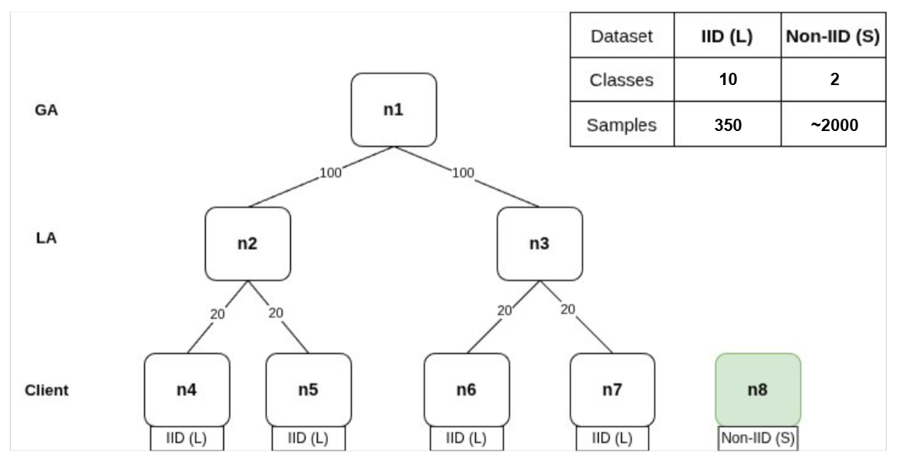

# Hands-on Session on AIoTwin Orchestration Middleware

This is the README for the **Hands-on Session on AIoTwin Orchestration Middleware Part II.: Framework for Adaptive Orchestration of FL Pipelines​**.
This README shows step-by-step instructions for running an FL pipeline using our framework on the UNIZG-FER infrastructure.

## Prerequisites

The only prerequisite is to have a terminal for SSH connection (Linux/MacOS terminal, Git Bash, Putty, etc.) and Postman installed for HTTP requests to the orchestrator. Download Postman from here: https://www.postman.com/downloads/

## Instructions

Like in the Part I. of the session, open an SSH connection to the jump server. Then, create an SSH connection to the host that runs the FL orchestrator:
``` bash
ssh iotlab@hfl-k3s-master
```

Inside the `hfl-k3s-master` node, create a [Linux screen](https://linuxize.com/post/how-to-use-linux-screen/) to run multiple terminals from the same connection (replace X with your group number):

``` bash
screen -S group-X 
```

In the screen mode, you can create new screens with `Ctrl+a c`, move between screens with `Ctrl+a N` (replace N with screen number), and detach from the screen with `Ctrl+x d`. To scroll within the screen mode, press `Ctrl+a Esc` and then move up and down with `Page Up` and `Page Down` keys.
We recommend to open at least three screens for this hands on session.

Each group will have their own orchestrator running on top of a K3s cluster, with 7 nodes assigned to their group for running the FL pipeline. Position your terminal to the root directory of the orchestrator given to your group (replace X with your group number):

``` bash
cd iot-conf-tutorial/group-X/fl-orchestrator/
```

Run all the following commands from that root directory.

---------------------------------------------------------------------------------------------------------------------------------------------------------------------------------


## Part 1. Running a Default Task - Performance Degradation
Default setups show performance degradation when a new node is added to the cluster. The topology is illustrated below:




### Starting the orchestrator

Position your terminal to the main directory of the HTTP server that exposes orchestrator functionalities and start the server:

``` bash
cd cmd/http
go run main.go sim group-X
```
```
2025-06-10T15:55:34.396+0200 [INFO]  fl-orch: Starting server on port: 8081
```

### Starting an FL pipeline

To start an FL pipeline, send a POST request to `http://161.53.133.104:80/group-X/fl/start` (replace X with your group number, e.g. `group-1`). Send the request with Postman and provide the following request body (set the type to raw -> JSON):

```
{
  "epochs": 1,
  "localRounds": 2,
  "trainingParams": {
    "batchSize": 32,
    "learningRate": 0.001
  },
  "configurationModel": "minCommCost",
  "modelSize": 3.3,
  "costSource": "COMMUNICATION",
  "costConfiguration": {
    "costType": "totalBudget",
    "budget": 17000
  },
  "rvaEnabled": true
}
```


### Monitoring the pipeline progress

To monitor the progress of the pipeline, first check the orchestrator's logs, to make sure that the pipeline was successfully deployed, see how the nodes are clustered, and later you can also monitor the progress of the model performance over global rounds (model accuracy and loss). In the beginning, it should look something like this:

```
2025-06-11T12:51:17.366+0200 [INFO]  fl-orch: Starting server on port: 8081
2025-06-11T12:51:23.688+0200 [INFO]  fl-orch: Starting FL with config minCommCost, modelSize 3.300000, and cost type totalBudget
Optimal clusters: [n4 n5] [n7 n6] 
Cost per global round: 1188.00
2025-06-11T12:51:23.688+0200 [INFO]  fl-orch: Global aggregator ::
        Node id:n1      | Rounds:100
Local aggregators ::
        Node id:n2      | Parent address:fl-ga-svc-n1:8080      | Local rounds:2 Rounds:100
        Node id:n3      | Parent address:fl-ga-svc-n1:8080      | Local rounds:2 Rounds:100
Clients ::
        Node id:n4      | Parent node:n2        | Epochs:2
        Node id:n5      | Parent node:n2        | Epochs:2
        Node id:n7      | Parent node:n3        | Epochs:2
        Node id:n6      | Parent node:n3        | Epochs:2
Epochs:  2
Local rounds:  2

2025-06-11T12:51:23.701+0200 [INFO]  fl-orch: Global aggregator deployed!
2025-06-11T12:51:53.727+0200 [INFO]  fl-orch: Local aggregator deployed!
2025-06-11T12:51:54.736+0200 [INFO]  fl-orch: Local aggregator deployed!
2025-06-11T12:52:55.742+0200 [INFO]  fl-orch: Client n4 deployed!
2025-06-11T12:52:56.747+0200 [INFO]  fl-orch: Client n5 deployed!
2025-06-11T12:52:57.753+0200 [INFO]  fl-orch: Client n7 deployed!
2025-06-11T12:52:58.759+0200 [INFO]  fl-orch: Client n6 deployed!
2025-06-11T12:52:59.822+0200 [INFO]  fl-orch: Finished global round 0
2025-06-11T12:52:59.822+0200 [INFO]  fl-orch: Latest accuracy: 0.10
2025-06-11T12:52:59.822+0200 [INFO]  fl-orch: Latest loss: 2.30
2025-06-11T12:52:59.822+0200 [INFO]  fl-orch: Started global round 1
```

Note that local aggregators are deployed before the global aggregator finishes initializing, and clients are deployed after the local aggregators are ready. This ensures that each parent aggregator is fully initialized before its child nodes attempt to connect.

Since the FL services are deployed on K3s, check the pods that are running the services (use the group-X for your group, i.e. `group-1`):

```bash
kubectl -n group-X get pods
```
```
NAME                        READY   STATUS    RESTARTS   AGE
fl-cl-n4-55b9cbccc7-zrk2s   1/1     Running   0          2m42s
fl-cl-n5-76b7d8866-8562z    1/1     Running   0          2m41s
fl-cl-n6-69d8f95c56-wpwp7   1/1     Running   0          2m39s
fl-cl-n7-59559688cf-6t6jw   1/1     Running   0          2m40s
fl-ga-bc87b7559-pr7fd       1/1     Running   0          4m14s
fl-la-n2-5499d6c748-67ljh   1/1     Running   0          3m44s
fl-la-n3-5b6bf567c9-k4cz4   1/1     Running   0          3m43s
```

Finally, to see the logs of a client (or any pod running the FL service), run the following command (replace the pod name with your pod):

```bash
kubectl -n group-X logs fl-cl-n4-55b9cbccc7-zrk2s
```

### See accuracy/loss/cost progress logs

```bash
cd experiments/results
cat "$(ls -Art | tail -n 1)" # fetch latest experiment logs
```
To plot accuracy/cost use:
https://colab.research.google.com/drive/1o4Wfo98heE7ZrsZqTMYdOcqnCyTWF2fQ?usp=sharing

### Removing the pipeline

The safest way to remove and restart the pipeline in this tutorial is to kill the orchestrator (`Ctrl+C` in the terminal where it was started) and run the cleanup script:

```bash
cd scripts
./cleanup.sh group-X
```

Due to the limited resource availability in the test cluster, wait for all the pods to be terminated before running another pipeline:

```bash
kubectl -n group-X get pods
```
```
No resources found in group-X group-X.
```


---------------------------------------------------------------------------------------------------------------------------------------------------------------------------------
Once you run the pipeline with default parameters, try pipelines with different HFL parameters (`epochs` and `localRounds`) and training parameters to see their impact on the model performance.


### Configuring the topology

The simulated topology is defined in the CSV file with the following columns: <br/>
`node_id,fl_type,communication_costs,energy_cost,num_partitions,partition_id`. 

FL type can be global aggregator (GA), local aggregator (LA) or client, communication costs are defined towards the possible parent aggregators (from clients to LA's and from LA's to GA), and data distribution is not used in this tutorial.

In the first part of the session, you will just run the preconfigured simulated topology. You can view it with the following command:
``` bash
cat configs/cluster/cluster.csv
``` 

Later, to change and configure a simulated topology of the experiment, edit the following file (you can use `vim` editor if preferred):

``` bash
nano configs/cluster/cluster.csv
```

(Optional) You can also simulate changes in the topology during runtime. At any moment, delete a node (remove the line) or add a new node to the topology file (`cluster.csv`) and it will automatically trigger the reconfiguration of the environment. Also, after 10 global rounds, the simulation mode appends the content of the `changes.csv` file to `cluster.csv` which introduces a topology change. Currently, it is empty, but you can add nodes in the file and wait to be added during runtime.

### Defining the FL task

The FL task is defined through the Python file `task.py`. First, check the template for defining the task which lists all the methods that have to be implemented:

``` bash
cat configs/fl/task/task_template.py
```

In the first part of the session, you will run the pipeline with the preconfigured task. You can view it with the following command:
``` bash
cat configs/fl/task/task.py
``` 

Later, change the task that is run within the pipeline by editing the following file:

``` bash
nano configs/fl/task/task.py
```

You can see examples of an FL task training on CIFAR-10 or MNIST datasets in the directory `configs/fl/task/examples`.


